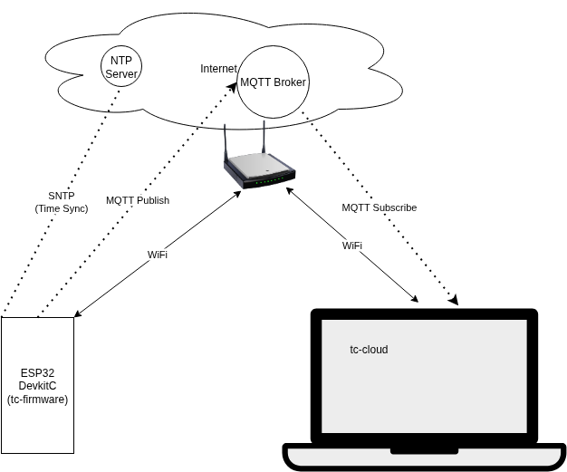
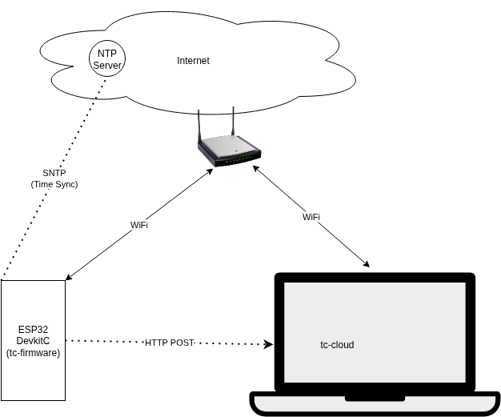

# Telemetry Challenge (tc-cloud + tc-firmware)

End-to-end IoT telemetry demo with an ESP32 firmware(tc-firmware) and a FastAPI app (tc-cloud). The ESP32 publishes GPS + battery data over MQTT or HTTP (select one in firmware); the FastAPI app ingests, stores to SQLite, and serves a simple dashboard with CSV downloads.

- Firmware: `tc-firmware/` (ESP‑IDF)
- Cloud app: `tc-cloud/` (FastAPI, SQLite, MQTT/HTTP ingest)

For complete details, see the subproject guides:
- tc-cloud/README.md
- tc-firmware/README.md

## Repository Structure

- `tc-cloud/` — FastAPI app subscribing to MQTT topic and exposing an HTTP `/ingest` endpoint. Stores to `database.db` and serves a dashboard.
- `tc-firmware/` — ESP‑IDF project generating telemetry and sending via MQTT or HTTP at a configurable interval.

## Architectures

### Architecture 1 — Cloud MQTT Broker

The ESP32 connects over WiFi, syncs time via SNTP with an Internet NTP server, and publishes telemetry to a cloud-hosted MQTT broker. The `tc-cloud` app subscribes to the cloud broker to receive real-time data. In this architecture, firmware uses MQTT only.

- ESP32 (tc-firmware): WiFi STA + SNTP, publishes via MQTT only.
- Router: Provides WiFi and Internet connectivity.
- MQTT Broker (Cloud): Hosted off-site (e.g., public broker). Central message hub.
- tc-cloud (Laptop): Subscribes to the broker over the Internet; also exposes HTTP `/ingest`.

Communication flows
- Time Sync: ESP32 → Internet → NTP Server
- Telemetry (MQTT): ESP32 → Router → Internet → Cloud MQTT Broker
- Data Retrieval (MQTT): Cloud MQTT Broker → Internet → Router → tc-cloud

### Architecture 2 — Local MQTT Broker

Local setup where the MQTT broker runs on the same laptop as `tc-cloud`. MQTT traffic stays on the local network; the ESP32 still uses the Internet only for NTP time sync. In this architecture, firmware uses MQTT only.

- ESP32 (tc-firmware): WiFi STA + SNTP, publishes via MQTT only.
- Router: Local WiFi connectivity and Internet for time sync.
- tc-cloud (Laptop) + Local MQTT Broker: The app and broker run on the laptop.

Communication flows
- Time Sync: ESP32 → Router → Internet → NTP Server
- Telemetry (MQTT): ESP32 → Router → Local MQTT Broker (on laptop)
- Data Retrieval (MQTT): Local MQTT Broker → tc-cloud (same laptop)

### Architecture 3 — HTTP Direct

HTTP-only setup. The ESP32 posts telemetry directly to the `tc-cloud` FastAPI app. No MQTT broker is required by the firmware.

- ESP32 (tc-firmware): WiFi STA + SNTP, sends only HTTP POST to HTTP server.
- Router: Local WiFi connectivity and Internet for time sync.
- tc-cloud (Laptop): Runs FastAPI app exposing `POST /ingest`.

Communication flows
- Time Sync: ESP32 → Router → Internet → NTP Server
- Telemetry (HTTP): ESP32 → Router → tc-cloud

### Shared prerequisites

- Ensure the laptop and ESP32 are on the same WiFi network.
- MQTT (Architectures 1 & 2): use topic `tc-bn/telemetry/<device_id>` (tc-cloud subscribes to `tc-bn/telemetry/+`).
- HTTP (Architecture 3): ESP32 must reach the laptop’s IP (port 8000 by default).

### Architecture 1 — Cloud MQTT Broker

tc-cloud/ (FastAPI)
1) Create/activate venv and install requirements (see tc-cloud/README.md).
2) Configure `.env` if needed:
   - `MQTT_HOST=broker.emqx.io` (or your cloud broker hostname)
   - `MQTT_PORT=1883`
   - `DATABASE_PATH=./database.db`
3) Run the app: `fastapi run main.py` then open `http://127.0.0.1:8000/`.

tc-firmware/ (ESP‑IDF)
1) `idf.py set-target esp32`
2) `idf.py menuconfig` → BuddyNinjaTechnicalChallenge:
   - Set WiFi SSID/Password.
   - Enable MQTT (`CONFIG_TC_MQTT_ENABLED=y`).
   - Set MQTT Broker URL to your cloud broker, e.g. `mqtt://broker.emqx.io:1883`.
3) `idf.py -p <PORT> build flash monitor`

### Architecture 2 — Local MQTT Broker

Run a local MQTT broker on the laptop (e.g., Mosquitto) listening on port 1883.

tc-cloud/ (FastAPI)
1) Create/activate venv and install requirements (see tc-cloud/README.md).
2) Configure `.env` to point to the local broker:
   - `MQTT_HOST=127.0.0.1` (or the laptop’s LAN IP)
   - `MQTT_PORT=1883`
   - `DATABASE_PATH=./database.db`
3) Run the app: `fastapi run main.py` then open `http://127.0.0.1:8000/`.

tc-firmware/ (ESP‑IDF)
1) `idf.py set-target esp32`
2) `idf.py menuconfig` → BuddyNinjaTechnicalChallenge:
   - Set WiFi SSID/Password.
   - Enable MQTT (`CONFIG_TC_MQTT_ENABLED=y`).
   - Set MQTT Broker URL to the laptop’s LAN IP, e.g. `mqtt://<laptop-ip>:1883`.
3) `idf.py -p <PORT> build flash monitor`

### Architecture 3 — HTTP Direct (HTTP only)

tc-cloud/ (FastAPI)
1) Create/activate venv and install requirements (see tc-cloud/README.md).
2) Run the app: `fastapi run main.py` then open `http://127.0.0.1:8000/`.

tc-firmware/ (ESP‑IDF)
1) `idf.py set-target esp32`
2) `idf.py menuconfig` → BuddyNinjaTechnicalChallenge:
   - Set WiFi SSID/Password.
   - Disable MQTT (`CONFIG_TC_MQTT_ENABLED=n`).
   - Set HTTP Server URL to laptop: `http://<laptop-ip>:8000/ingest`.
3) `idf.py -p <PORT> build flash monitor`